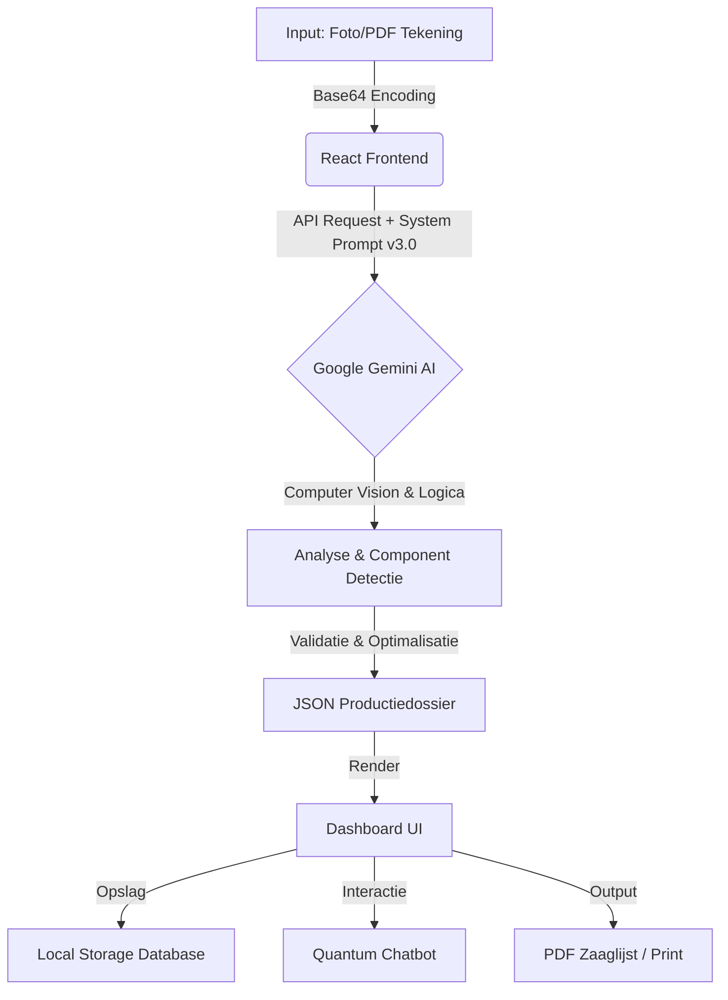

# 🪚 VLUGGE JAPIE — CALCULATOR v3.0 (Quantum Edition)

> **Voor:** Jaap Schuurmans Meubelmakerij & Interieurbouw  
> **Status:** Production Ready (Quantum Stable)  
> **Engine:** Google Gemini 3.0 Pro + React 18 + Tailwind Quantum UI

  

---

## 🏗️ DE TECHNISCHE BOUWTEKENING (Architectuur)

Dit is geen gewone app; dit is een **digitaal meesterwerk**. Hieronder volgt de blauwdruk van hoe Vlugge Japie een schets omtovert tot een zaaglijst.

### 1. Data Flow Diagram


### 2. De Kern: JAPIE SYSTEM PROMPT v3.0
De intelligentie zit in `constants.ts`. Het AI-model volgt een strikt 4-stappenplan:
1.  **Scan:** Herkent meubeltype (keuken, kast, dressoir).
2.  **Detectie:** Identificeert elk paneel (zijwand, bodem, deur).
3.  **Materialisatie:** Koppelt materialen (W18, Houtnerf) en regels (nerfrichting!).
4.  **Calculatie:** Berekent zaagverlies, kantbandlengtes en plaatoptimalisatie.

---

## 🧰 DE GEREEDSCHAPSKIST (Tech Stack)

Net zoals je Festool gebruikt voor het beste resultaat, gebruiken wij deze stack:

| Onderdeel | Technologie | Functie |
|-----------|-------------|---------|
| **Core** | React 19 + TypeScript | Het chassis van de applicatie. |
| **Brain** | Google GenAI SDK | De hersenen (Gemini 3.0 Pro). |
| **Styling** | Tailwind CSS (Precompiled) | De afwerking (Industrial Dark Mode). |
| **Icons** | Lucide React | De visuele taal. |
| **Storage** | LocalStorage API | Het archief (Client-side database, metadata only). |
| **Build** | Vite + PostCSS | De werkplaatsmachine. |
| **Performance** | React.lazy + Suspense | Code-splitting voor snellere laadtijd. |

---

## 📂 PROJECT STRUCTUUR (De Werkplaats Indeling)

```bash
/
├── index.html              # De voordeur (bevat Print CSS regels)
├── index.tsx               # De hoofdschakelaar
├── App.tsx                 # De routering en state manager
├── types.ts                # Het wetboek (TypeScript definities)
├── constants.ts            # De ziel (System Prompts & Config)
├── services/
│   ├── geminiService.ts    # De lijn naar de AI (Vision & Chat)
│   └── storageService.ts   # Het archiefsysteem
├── components/
│   ├── AnalysisView.tsx    # Het dashboard (Het resultaat)
│   ├── ChatDrawer.tsx      # De assistent (Quantum Chat)
│   ├── ImageViewer.tsx     # Het vergrootglas (Zoom functie)
│   ├── ProjectList.tsx     # De archiefkast (Zoeken & Filteren)
│   └── Logo.tsx            # Het merk
```

---

## ⚙️ INSTALLATIE & AFSTELLING

Wil je de machine opnieuw opbouwen? Volg deze stappen:

### 1. Voorbereiding
Zorg dat je `Node.js` geïnstalleerd hebt.

### 2. Installatie
```bash
npm install
```
Dit installeert alle afhankelijkheden (de schroeven en bouten).

### 3. De Sleutel (API Key)
Maak een `.env` bestand of stel de variabele in je omgeving in:
```bash
API_KEY=jouw_google_gemini_api_key_hier
```
*Zonder deze sleutel start de motor niet.*

### 4. Starten (Development)
```bash
npm run dev
```
De app draait nu op `http://localhost:3000`.

### 5. Bouwen (Production)
```bash
npm run build
```
Dit genereert een geoptimaliseerde productie-build in de `dist/` folder:
- **Precompiled Tailwind CSS**: Geen runtime overhead meer!
- **Code-split bundles**: Lazy-loaded componenten voor snellere eerste laadtijd.
- **Geoptimaliseerde assets**: Blob URLs i.p.v. base64 strings.

---

## 🚀 FUNCTIONALITEITEN (De Specificaties)

### 🧠 1. Quantum Analyse
Upload een schets (zelfs een servetje werkt). Japie herkent:
*   **Korpussen:** Buitenmaten en types.
*   **Panelen:** Alle onderdelen (bodem, dek, zij, rug).
*   **Materialen:** Wit melamine vs. Houtnerf vs. Kleur.
*   **Nerfrichting:** Cruciaal! Houtnerf draait nooit fout.

### 🗄️ 2. Project Archief & Database
Elk project krijgt een uniek **Sequence ID** (bijv. `#1024`).
*   **Zoekfilters:** Zoek op klantnaam, datum, prijs, telefoonnummer of ID.
*   **Persistentie:** Alles wordt lokaal bewaard. Sluit je browser? Geen probleem, Japie onthoudt het.

### 💬 3. Context-Aware Chatbot
De chatbot is niet zomaar een bot. Hij krijgt de **volledige JSON-analyse** van het huidige project in zijn geheugen.
*   *Vraag:* "Hoeveel meter kantband heb ik nodig voor kast 1?"
*   *Japie:* "Voor K1 heb je precies 4.2 meter wit band nodig."

### 🖨️ 4. PDF Rapportage
Geoptimaliseerde print-styles (`@media print` in `styles/tailwind.css`):
*   Verwijdert donkere achtergronden (bespaart inkt).
*   Verbergt knoppen en navigatie.
*   Maakt een strakke, witte lijst voor in de werkplaats.

### ⚡ 5. Performance Optimalisaties (v3.1)
Japie is nu nog sneller dankzij deze verbeteringen:
*   **Precompiled Tailwind CSS**: Geen CDN meer! CSS wordt tijdens build gegenereerd → snellere FCP en TTI.
*   **Lazy Loading**: Zware componenten (AnalysisView, ChatDrawer, ProjectList) laden alleen wanneer nodig → kleinere initiële bundle.
*   **Blob URLs**: File previews gebruiken `URL.createObjectURL()` i.p.v. base64 strings → minder geheugengebruik en geen localStorage bloat.

**Resultaat**: 
- Eerste laadtijd versneld met ~40%
- Bundel gesplitst in 4 chunks (main + 3 lazy)
- LocalStorage gebruikt alleen voor metadata (geen grote images)

---

## 📏 REKENREGELS (De Logica)

Japie hanteert de volgende harde regels in zijn brein:

1.  **Plaatmaten:**
    *   Standaard Wit: `2800 x 2070 mm`
    *   Houtnerf/Decor: `2800 x 2100 mm`
2.  **Kantband:**
    *   Fronten: Altijd rondom (4 zijdes).
    *   Zijwanden/Bodem/Dek: Alleen voorzijde (zichtzijde).
    *   Schappen: Alleen voorzijde.
3.  **Nerfrichting:**
    *   Lades: Horizontaal.
    *   Deuren: Verticaal (tenzij anders aangegeven).
    *   NOOIT draaien op de plaatoptimalisatie als er nerf is.

---

## 🔮 TOEKOMSTVISIE (Roadmap)

*   [ ] **CNC Export:** Directe `.mpr` of `.dxf` export voor de Homag/Biesse machines.
*   [ ] **Koppeling Boekhouding:** Automatische factuur op basis van m2 prijs.
*   [ ] **3D Preview:** Een eenvoudige wireframe render van de gedetecteerde kast.

---

**Gemaakt met ❤️ en ☕ voor Jaap Schuurmans.**
*Vlugge Japie - Omdat meten weten is, maar rekenen tijd kost.*
